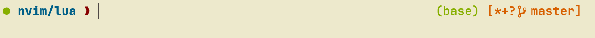
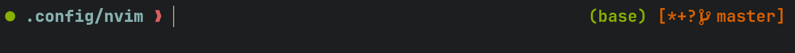

# macos-configs
Some helpful configurations for setting up new macs.
This is an opinionated guide, and reflects my (ever evolving) personal preferences.
Feel free to take it and make it your own. 

## Requirements:
git
brew
coreutils
bat
ripgrep
wezterm
neovim
zsh-autosuggestions
fzf
fd
node
ncdu
ncurses
git-delta
TODO: Cleanup requirements. Make installer scripts

## Instructions:
1. copy current zshrc into a backup file
2. make directory `~/.config/` (if it doesn't exist)
3. Install dependencies and copy contents of .config directory on this repo to your own ~/.config
4. copy .dircolors to your home-directory
5. symlink ~/.zshrc to .config/zsh/zshrc
6. symlink ~/.gitconfig to .config/gitconfig/.gitconfig
7. Double check paths (unfortunately some are hard-coded at the moment, fix in the future) and source.
    * In `.config/zsh/zshrc` need to edit `__conda_setup` 
    * In `.config/zsh/zsh_functions` need to edit ssh-convenience functions w/ your own user@host.
    * In `.config/gitconfig/.gitconfig` need to edit `name` and `email` fields.

### Highlights
1. Colorscheme: modified gruvbox (see .dircolors)
2. Functions to switch colorschme between dark/light based on MacOS mode.
3. Minimal prompt displaying `cwd`, `conda-info` and `git-info`.
4. Async loading for the above functions so they don't struggle with large git repos.
5. Convenience functions for `ssh` and tunneling. path to keys, and host addresses have been redacted.
6. Convenience functions for navigation `tmb` and `ds` (to avoid ../.. ad nauseum.)
7. `vi` mode for typing shell commands. (TODO: support for text objects)
8. fuzzy-finding for navigating files and directories, with previews (avoid cd && ls ad nauseum)
9. Better diffs with `git-delta`

## Terminal
I have been experimenting with `wezterm` and enjoy using it. This is optional, but recommended.
Minimal config. included

## ZSH

One of the goals for my zsh-config was not relying too heavily on 
external dependencies, and plugin managers (e.g. OMZ). 

This config does make use of `fzf` (for fuzzy finding) and `zsh-autosuggestions`. These are optional.
Additionally, it utilises `ripgrep` and `bat`, but these can be replaced `grep` and `cat`.
Another optional utility is `git-delta` for better diffs.
Another requirement is replacing built-in `ls` with `gls` from GNU-coreutils. 
`brew install coreutils`.

Some representative screenshots.

1. lightmode

2. darkmode


Left prompt shows 
* green/red dot : success/failure of last executed commands.
* truncated path

Right prompt shows
* Conda environment
* Git branch. `*`,`+`,`?` indicate presence of modified, staged and untracked files respectively.

If you want to automatically switch between light and dark based on your system light and dark mode, ensure following lines in wezterm config.
```
--function to check OS mode, and set theme--
function scheme_for_appearance(appearance)
  if appearance:find 'Dark' then
    return 'Gruvbox dark, hard (base16)'
  else
    return 'Gruvbox light, hard (base16)'
  end
end
```
Following function is used to do the same for the zsh prompt and dircolors (async fashion, see the actual source file for complete details)

```
set_colors() {
  apple_interface_style=$(defaults read -g AppleInterfaceStyle 2>/dev/null)
  if [[ $apple_interface_style == "Dark"  ]]; then
    # Dark mode is enabled
    # Set your preferred dark mode color scheme here
    CWD_COLOR="109"
    CONDA_ENV_COLOR="106"
    GIT_INFO_COLOR="166"
    SUCCESS_COLOR="106"
    FAILURE_COLOR="124"
    PROMPT_CHAR_COLOR="167"
  fi
  if [[ -z $apple_interface_style ]]; then
    # Light mode is enabled
    # Set your preferred light mode color scheme here
    CWD_COLOR="24"
    CONDA_ENV_COLOR="106"
    GIT_INFO_COLOR="166"
    SUCCESS_COLOR="106"
    FAILURE_COLOR="124"
    PROMPT_CHAR_COLOR="88"
  fi
}

```
## (Neo)vim

TODO: configs. are a work in progress. A minimal working 
config will be uploaded soon.
